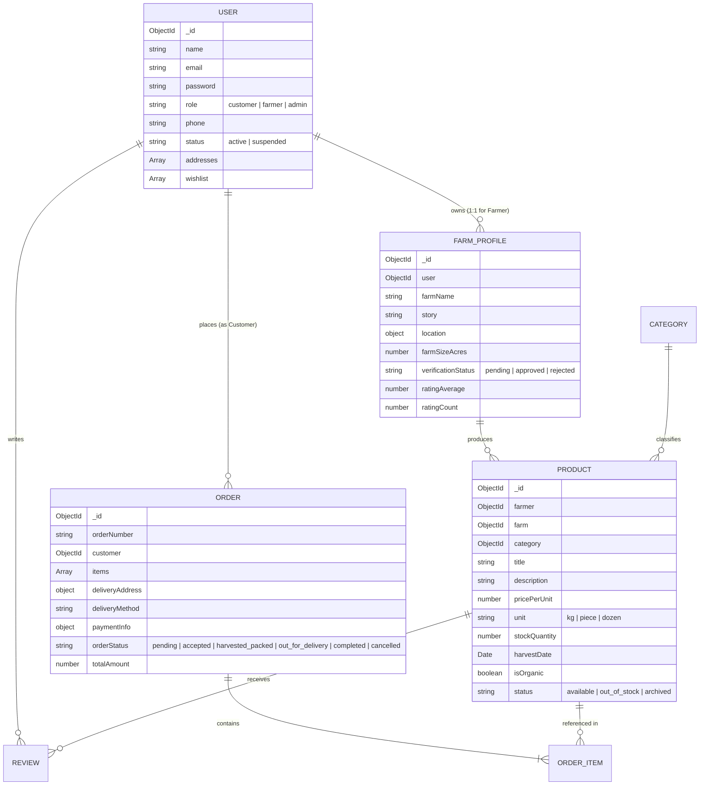

# 🌾 Farmer-to-Customer (FarmToTable) Produce Booking Platform

> **A Direct-to-Consumer (D2C) Agricultural E-Commerce & Produce Booking Platform**  
> *Developed for Final-Year BCA Project Demonstration*

---

## 📌 Project Overview

The **Farmer-to-Customer Produce Booking Platform** is an enterprise-ready web application designed to eliminate intermediaries and direct-connect local farmers with end consumers. By providing transparent pricing, real-time stock management, fresh harvest schedules, and direct farm profiles, the platform ensures farmers receive fair compensation while customers gain access to organic, farm-crisp produce.

---

## ✨ Key Features

### 🛒 Customer Features
- **Browse & Search Produce**: Filter by 6 organic categories, price range, organic accreditation, and search keyword.
- **Product Details & Ratings**: View harvest date, farm origin, stock levels, customer reviews, and ratings.
- **Wishlist Management**: Save favorite produce listings for fast access.
- **Cart & Dynamic Checkout**: Supports Cash on Delivery (COD) and Card/UPI Payment simulation via Stripe integration.
- **Order Tracking & History**: Track order lifecycle (`pending` ➔ `accepted` ➔ `harvested_packed` ➔ `out_for_delivery` ➔ `completed`).
- **Profile & Address Management**: Manage multiple delivery addresses and set default shipping locations.

### 🚜 Farmer Features
- **Farm Onboarding & Verification**: Onboard farm profile with land registry / FSSAI documentation submitted for admin review.
- **Produce Management**: Create, edit, update stock, and archive produce listings with image uploads.
- **Order Management**: Receive incoming customer orders, accept/reject based on harvest availability, and update fulfillment stages.
- **Analytics Dashboard**: Real-time tracking of total earnings, total orders, completed sales, and produce stock counts.

### 🛡️ Admin Features
- **Platform Analytics**: High-level GMV (Gross Merchandise Value) metrics, customer count, farmer verification queue, and total orders.
- **Farmer Moderation**: Review pending farm applications and verify/reject credentials.
- **Produce & User Moderation**: Toggle user active/suspended status and archive problematic listings.
- **System Reports**: Overview of top-performing farms, popular produce, and completed orders.

---

## 🛠️ Technology Stack

| Layer | Technologies Used |
| :--- | :--- |
| **Frontend** | React 18, Vite 5, React Router v6, Tailwind CSS 3, Lucide Icons, Axios |
| **Backend** | Node.js, Express.js (v4), Mongoose ODM |
| **Database** | MongoDB (v6+) / MongoDB Atlas |
| **Security & Utilities** | JWT (JSON Web Tokens), Bcrypt.js, Express Rate Limit, Express Mongo Sanitize, Multer |
| **Payment Integration** | Stripe API (with mock fallback mode for offline/demo environments) |

---

## 🗄️ Database Architecture (Entity-Relationship Diagram)



---

## 📡 REST API Endpoint Documentation

Base URL: `http://localhost:5000/api/v1`

### 🔑 Authentication (`/auth`)
| Method | Endpoint | Auth | Description |
| :--- | :--- | :--- | :--- |
| `POST` | `/auth/register` | Public | Register new customer or farmer |
| `POST` | `/auth/login` | Public | Authenticate user & get JWT token |
| `GET` | `/auth/me` | Protected | Get current logged-in user profile |
| `POST` | `/auth/forgot-password` | Public | Request password reset token |
| `POST` | `/auth/reset-password/:token` | Public | Reset password with valid token |

### 🥦 Produce Listings (`/products`)
| Method | Endpoint | Auth | Description |
| :--- | :--- | :--- | :--- |
| `GET` | `/products` | Public | List produce with filtering, search & sorting |
| `GET` | `/products/:id` | Public | Get single produce item details |
| `POST` | `/products` | Farmer (Approved) | Create new produce listing |
| `PUT` | `/products/:id` | Farmer (Approved) | Update existing produce listing |
| `PATCH` | `/products/:id/stock` | Farmer (Approved) | Update inventory stock level |
| `DELETE` | `/products/:id` | Farmer (Approved) | Archive/delete produce listing |

### 📦 Orders (`/orders`)
| Method | Endpoint | Auth | Description |
| :--- | :--- | :--- | :--- |
| `POST` | `/orders` | Customer | Place a new produce order |
| `POST` | `/orders/create-stripe-intent` | Customer | Create Stripe payment intent |
| `GET` | `/orders/my-orders` | Customer | Get customer order history |
| `PATCH` | `/orders/:id/cancel` | Customer | Cancel pending order |
| `GET` | `/orders/farmer-orders` | Farmer / Admin | Get farmer incoming orders |
| `PATCH` | `/orders/:id/accept` | Farmer / Admin | Accept incoming order |
| `PATCH` | `/orders/:id/reject` | Farmer / Admin | Reject incoming order & restore stock |
| `PATCH` | `/orders/:id/status` | Farmer / Admin | Advance order fulfillment status |

### 🛡️ Admin Moderation (`/admin`)
| Method | Endpoint | Auth | Description |
| :--- | :--- | :--- | :--- |
| `GET` | `/admin/analytics` | Admin | Get platform GMV & overview metrics |
| `GET` | `/admin/farmers/pending` | Admin | Get pending farmer verifications |
| `PATCH` | `/admin/farmers/:id/verify` | Admin | Approve or reject farmer profile |
| `PATCH` | `/admin/users/:userId/status` | Admin | Suspend or reactivate user account |

---

## 🔑 Demo Account Credentials

For quick evaluation and testing during project demonstration:

| Role | Email | Password | Details |
| :--- | :--- | :--- | :--- |
| **Administrator** | `admin@farmtotable.com` | `Password123!` | Full platform access, moderation & GMV stats |
| **Verified Farmer** | `farmer@greenacres.com` | `Password123!` | *Green Acres Organic Valley*, listing management |
| **Customer** | `customer@gmail.com` | `Password123!` | Active buyer account with order history |

---

## ⚡ Quick Start & Installation

### Prerequisites
- **Node.js**: v18.x or higher
- **MongoDB**: Local MongoDB instance running on `mongodb://127.0.0.1:27017` or MongoDB Atlas URI.

### Step 1: Clone Repository
```bash
git clone https://github.com/asujitharumugam/farmer-to-customer.git
cd farmer-to-customer
```

### Step 2: Set Up Backend (`server`)
```bash
cd server
npm install
```

Create a `.env` file in the `server` root directory:
```env
PORT=5000
MONGODB_URI=mongodb://127.0.0.1:27017/farmer-to-customer
JWT_SECRET=super_secret_farm_to_table_jwt_key_2026_production
JWT_EXPIRES_IN=7d
NODE_ENV=development
```

### Step 3: Seed Database
Populate 50 Indian produce items, categories, and test accounts:
```bash
npm run seed
```

### Step 4: Start Backend Server
```bash
npm run dev
```

### Step 5: Set Up Frontend (`client`)
Open a new terminal window:
```bash
cd client
npm install
npm run dev
```

The application will be running at:
- 🌐 **Frontend Application**: [http://localhost:5173](http://localhost:5173)
- 📡 **Backend API Server**: [http://localhost:5000](http://localhost:5000)

---

## 📜 License & Acknowledgments

Developed as a Final-Year Bachelor of Computer Applications (BCA) Capstone Project.  
Distributed under the **MIT License**.
